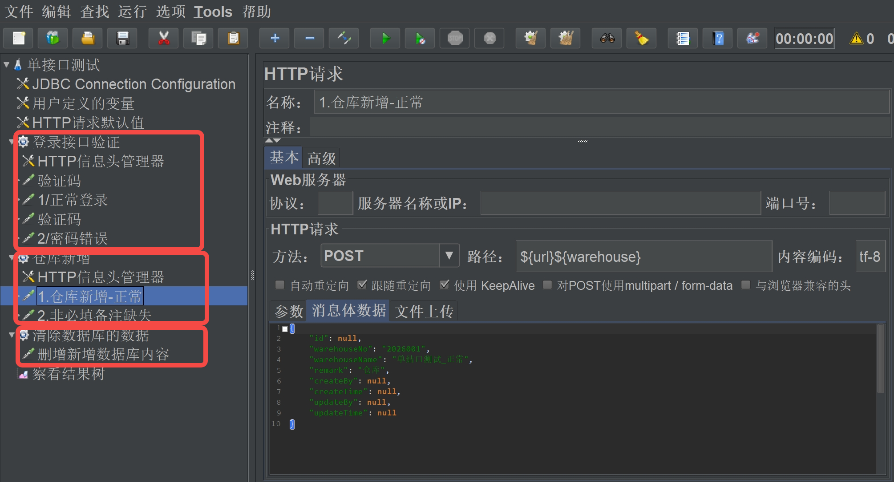
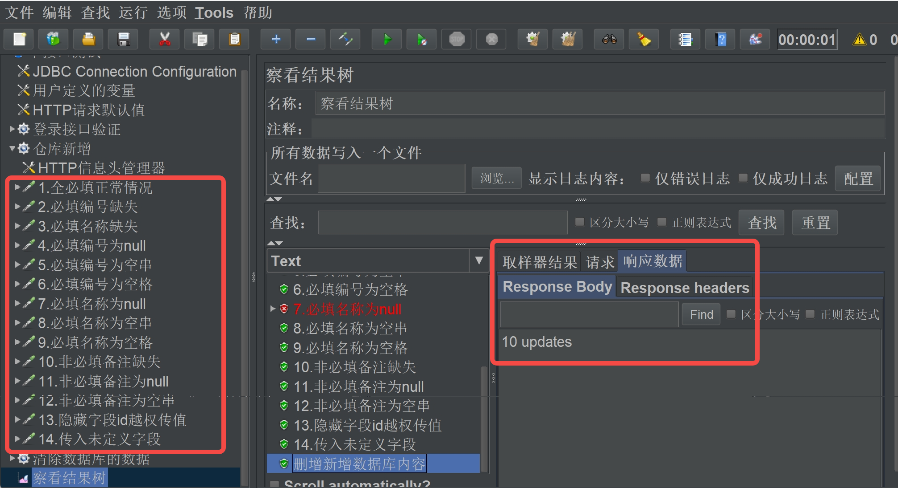

# JMeter Case Expander Skill

一个用于扩展 JMeter 接口测试用例的技能项目。

它会基于一个已有的正向 HTTP Sampler，在同一个 `.jmx` 文件中，针对指定线程组保守地补充高价值的负向和边界用例，并按需检查或收紧相关 JDBC 清理 SQL。

## 适用场景

适合下面这类场景：

- 你已经有一个可运行的 `.jmx` 文件
- 你只想处理这个 `.jmx` 里的一个目标线程组
- 线程组里已经有一个正向 HTTP Sampler 可作为模板
- 你已经知道哪些字段是必填、哪些是选填

这个项目不负责从零生成整套测试计划，而是面向“在现有 `.jmx` 上做保守增强”。

## 能补什么用例

默认会优先补充这些高价值场景：

- 必填字段缺失
- `null`
- 空字符串
- 空格字符串
- 类型错误
- 长度或数值越界
- 隐藏值覆盖
- 多余未定义字段

## v1.1 本轮优化

本轮主要维护“隐藏值”相关用例覆盖，不改变整体输入骨架，也不影响旧版 `hidden_fields` 字符串写法。

优化内容：

- 保留旧写法 `hidden_fields: ["id"]` 的行为，仍然只生成一个隐藏字段覆盖用例，确保旧规则文件的生成效果不变
- 支持在 `hidden_fields` 内使用对象写法，为单个隐藏值补充更细的覆盖数据
- 隐藏值对象写法会按固定顺序生成用例：业务允许的正确值、类型非法值、业务非法值、篡改值、越权值
- 每个隐藏值用例仍遵守“每次只改一个字段”的原则，避免组合爆炸

优化目的：

- 让隐藏值测试不只停留在“覆盖/注入”，而是能覆盖真实业务风险
- 把篡改和越权场景显式纳入回归用例，方便审查接口是否正确校验服务端隐藏值
- 将 v1.1 的增强收敛在 `hidden_fields` 内，避免把局部维护项扩展成新的主骨架字段

## 输入和输出

输入：

- `1` 个已有的 `.jmx` 文件
- `1` 个目标线程组
- `1` 个正向 HTTP Sampler
- `1` 份 JSON 规则文件

输出：

- `1` 个补完后的 `.jmx` 文件
- 可选的 inspect / review 结果，方便审查生成内容

## 使用方式

### 1. 先检查 `.jmx`

先确认目标线程组、基础 Sampler、请求路径、编码和 JDBC 请求：

```powershell
python .\jmeter-case-expander-skill\scripts\inspect_jmx.py `
  --input path\to\case.jmx `
  --thread-group "Target Thread Group"
```

### 2. 准备规则文件

规则文件是一个 JSON，至少需要这些字段：

- `thread_group`
- `base_sampler`
- `required_fields`
- `optional_fields`

参考示例：

- [sample-spec.json](jmeter-case-expander-skill/assets/sample-spec.json)
- [input-contract.md](jmeter-case-expander-skill/references/input-contract.md)

### 3. 生成补充用例

```powershell
python .\jmeter-case-expander-skill\scripts\patch_jmx.py `
  --input path\to\case.jmx `
  --output path\to\case-patched.jmx `
  --spec path\to\spec.json
```

说明：

- 只处理一个目标线程组
- 默认只做追加，不改无关线程组
- 默认复用原始正向请求结构

### 4. 回看生成结果

```powershell
python .\jmeter-case-expander-skill\scripts\review_jmx.py `
  --input path\to\case-patched.jmx `
  --thread-group "Target Thread Group"
```

## 仓库里的示例文件

- 原始 `.jmx`：
  [sample-thread-group.jmx](jmeter-case-expander-skill/assets/sample-thread-group.jmx)
- 规则 JSON：
  [sample-spec.json](jmeter-case-expander-skill/assets/sample-spec.json)
- 补完后的 `.jmx`：
  [sample-thread-group.patched.jmx](jmeter-case-expander-skill/assets/sample-thread-group.patched.jmx)

## 使用流程截图

### 1. 原始线程组与基础用例



### 2. 生成后的用例结果



## 项目结构

```text
.
├─ README.md
├─ screenshots/
└─ jmeter-case-expander-skill/
   ├─ SKILL.md
   ├─ assets/
   ├─ references/
   └─ scripts/
```
